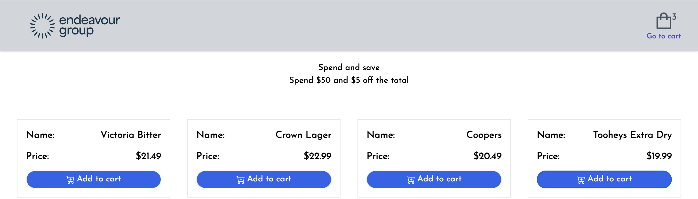

# eg-test

This project follows this data structure which will be generated on the server.

## Data structure

```data structure

{
  "products": [
    {
      "name": "Victoria Bitter",
      "price": 21.49,
      "discountKey": "Discount $2",
      "discountValue": "2"
    },
    {
      "name": "Crown Lager",
      "price": 22.99
    }
  ],
  "cartPromotions": {
    "name": "Spend and save",
    "discount": 5,
    "minCost": 50
  },
  "promotions": [
    {
      "name": "Current month special on VB",
      "definition": "$2.00 off",
      "type": "Product"
    },
    {
      "name": "Spend and save",
      "definition": "Spend $50 and $5 off the total",
      "type": "Trolley"
    }
  ]
}

```

## Installation

Install dependencies with npm

```bash
  cd eg-test
  npm install eg-test
```

## Run server

Open a bash prompt and cd in to the directory.

```bash
npm run server
```

## Run client

Open another bash prompt and cd in to the directory.

```bash
npm run client
```

## Demo

Access the application on:

http://localhost:5173

## Running Tests

To run tests, run the following command

```bash
  npm run test
```

# Screen shots
## Page 1
```

```
## Page 2
```

```
